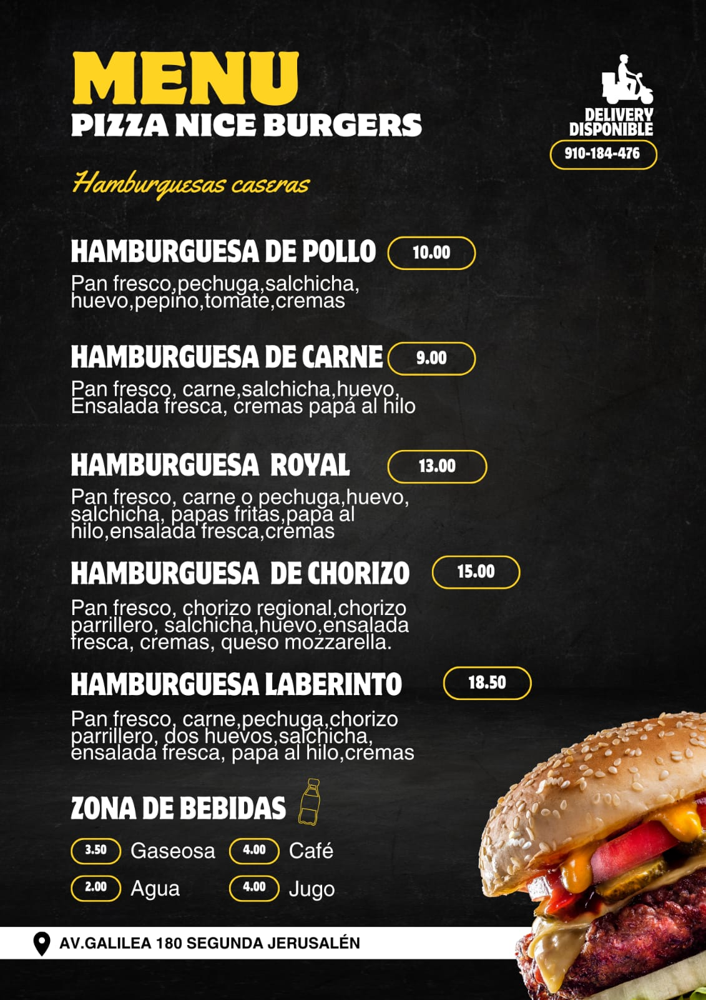
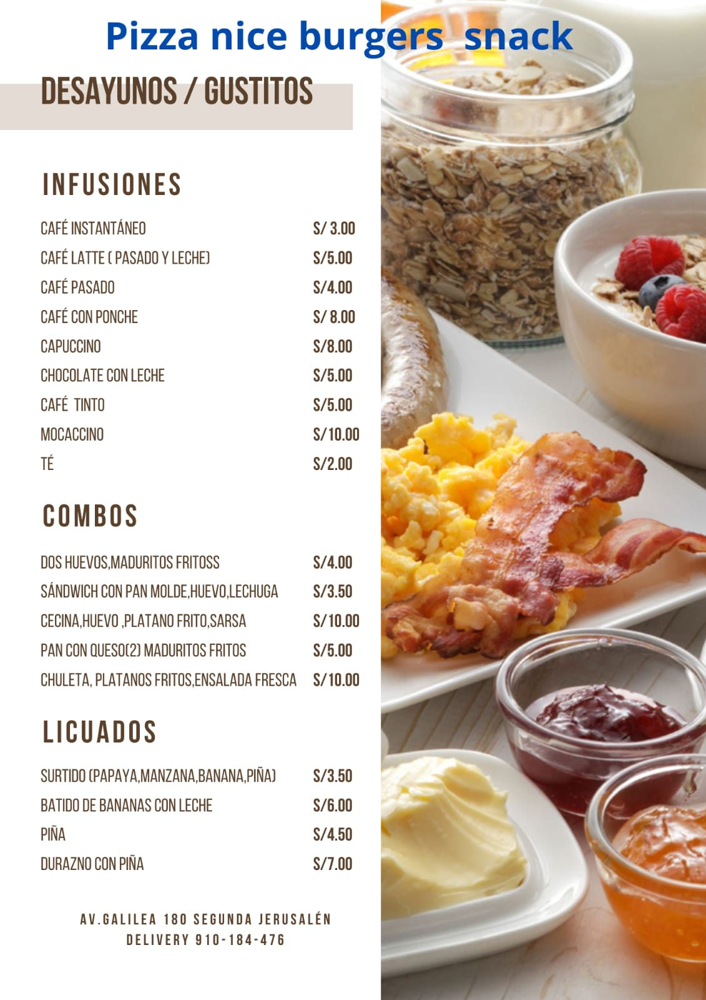
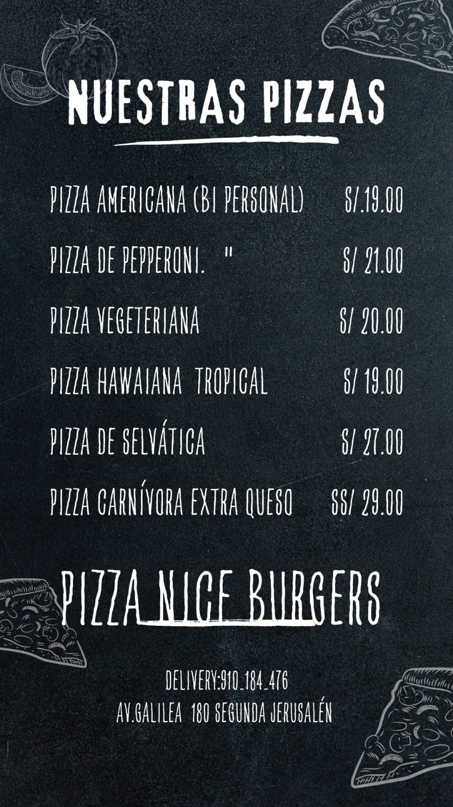
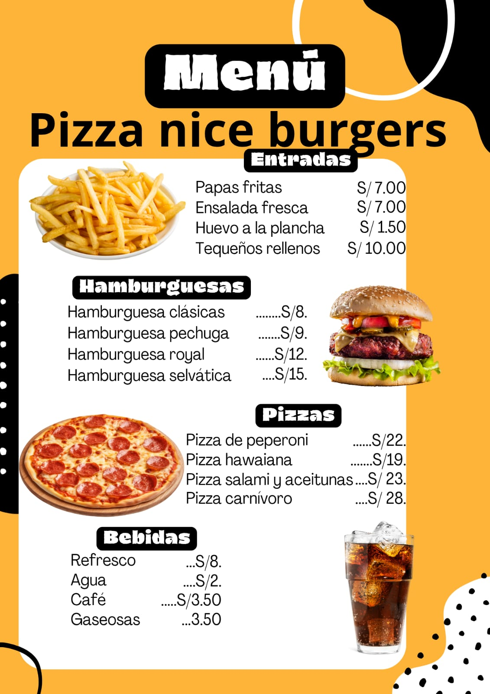
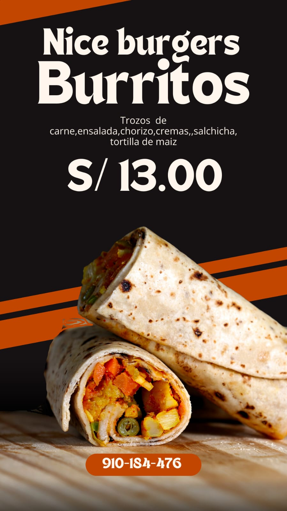
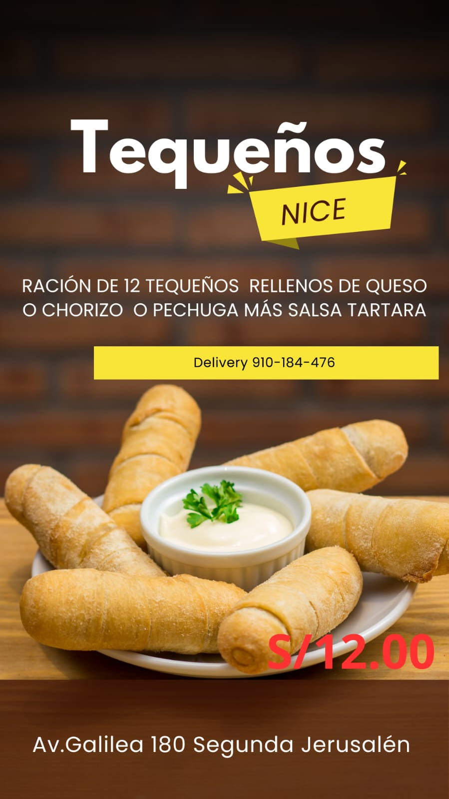
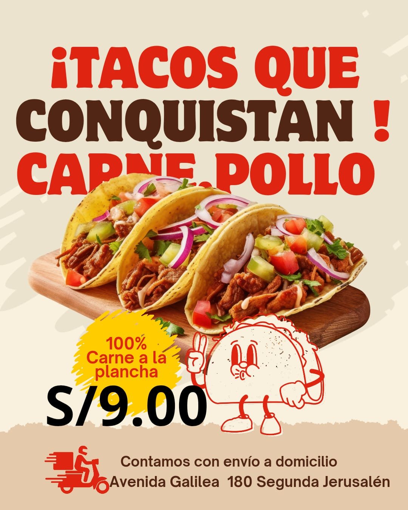

<html lang="es">
<head>
    <meta charset="UTF-8">
    <meta name="viewport" content="width=device-width, initial-scale=1.0">
    <title>Menú - Pizza Nice Burgers</title>
    
</head>
<body>
    <h1>🍕 Menú de Pizza Nice Burgers 🍔</h1>

    <section>
        
        
        
        
        
        
        
        
        
        
        
        
        
    </section>

</body>
</html>
